# PDV Distribuidora de Bebidas

## Requisitos

- **Java 17:** Necessário para rodar a aplicação.
- **Maven:** Para gerenciamento de dependências e build.
- **Banco de Dados H2:** Utilizado em ambiente de desenvolvimento.
- **Docker:** Para conteinerização da aplicação.
- **GitHub Actions e Jenkins:** Para automação de builds e deploys via pipeline de CI/CD.

## Visão Geral do Projeto

Este projeto é uma aplicação Spring Boot para gerenciar vendas, produtos, pagamentos, NF-e (Nota Fiscal Eletrônica), boletos e transações via Pix (Será implementado futuramente).

A aplicação está em fase de desenvolvimento do backend.

Por ser um projeto de estudo, ele será atualizado periodicamente de acordo com as necessidades e melhorias.

A aplicação utiliza o banco de dados H2.

## Iniciando o Projeto

Para iniciar o projeto, você precisará ter o Java 17 instalado em sua máquina.

A classe principal da aplicação é a `PdvBebidasApplication`.

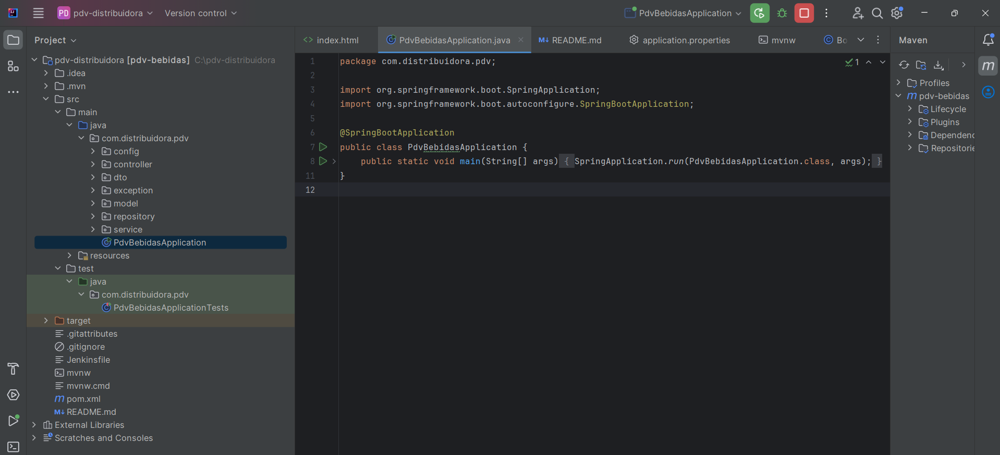

Ao iniciar o projeto, você precisará pegar a senha gerada pelo Spring Boot para acessar o banco de dados H2.

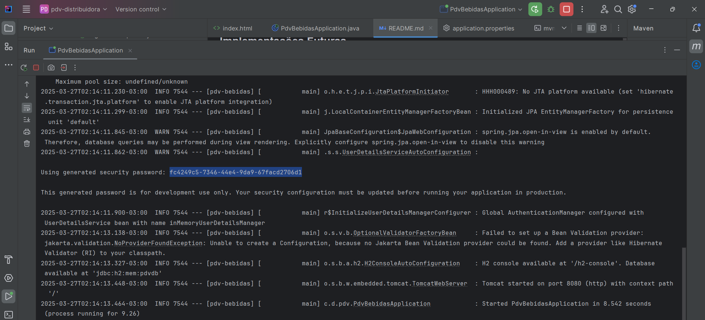

**Ao acessar http://localhost:8080 você poderá visualizar a página de login.**  
username: user  
password: senha gerada pelo Spring Boot

**No Postman utilize Authorization / Auth Type / Basic Auth para inserir as credenciais de usuário e senha.**

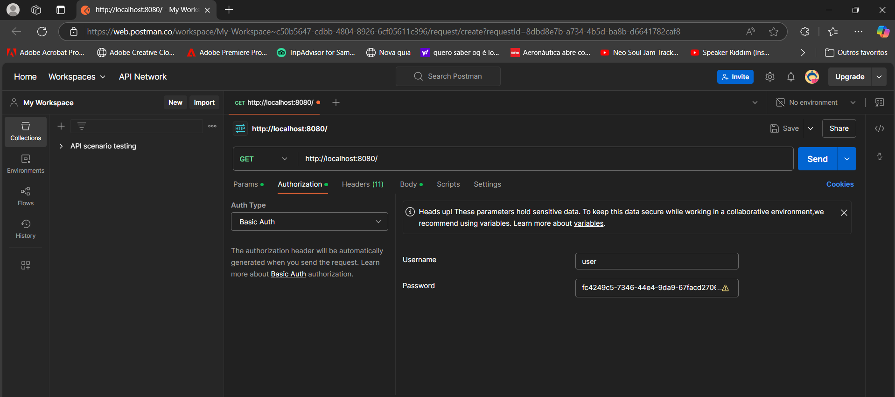

Se a requisição for bem sucedida, você poderá visualizar a página de boas-vindas.

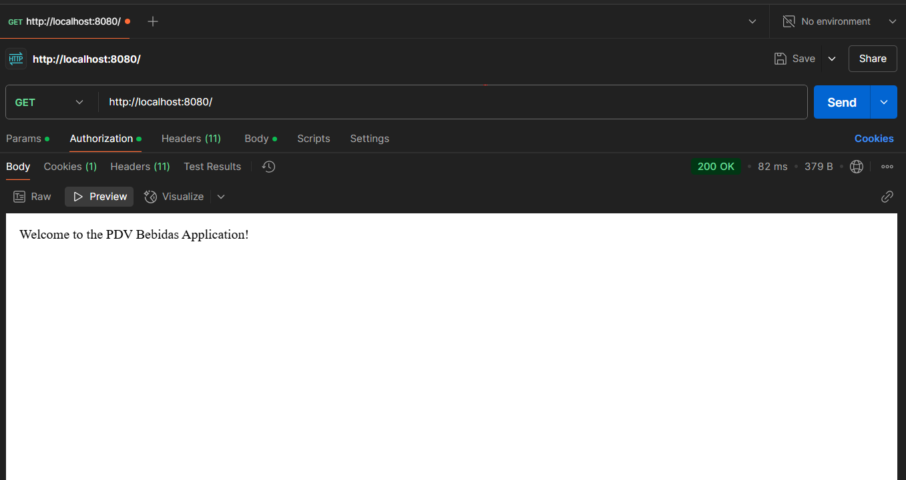

## Arquitetura

A aplicação segue uma arquitetura em camadas com controllers, services, models e DTOs.

## Estrutura de Classes

- **Controllers:** Responsáveis por lidar com requisições e respostas HTTP.

  - `BoletoController`: Gerencia operações de boletos.
  - `PagamentoController`: Gerencia operações de pagamento.
  - `VendaController`: Gerencia operações de vendas.
  - `ProdutoController`: Gerencia operações de produtos.
  - `NFController`: Gerencia operações de Nota Fiscal.

- **Models:** Representam a estrutura dos dados.

  - `Produto`: Representa um produto.
  - `Pagamento`: Representa um pagamento.
  - `Venda`: Representa uma venda.
  - `NF`: Representa uma Nota Fiscal.
  - `Boleto`: Representa um boleto.

- **DTOs:** Utilizados para transferência de dados entre camadas.
  - `ProdutoDTO`: Objeto de transferência de dados para produtos.
  - `PagamentoDTO`: Objeto de transferência de dados para pagamentos.
  - `VendaDTO`: Objeto de transferência de dados para vendas.
  - `NFDTO`: Objeto de transferência de dados para Nota Fiscal.
  - `BoletoDTO`: Objeto de transferência de dados para boletos.

## Tecnologias Utilizadas

- Spring Boot
- JPA
- Swagger para documentação da API

## Endpoints

- **Boleto:**

  - POST `/boletos/emitir`

- **Pagamento:**

  - POST `/pagamentos`

- **Venda:**

  - GET `/vendas`
  - POST `/vendas`

- **Produto:**

  - GET `/produtos`
  - POST `/produtos`

- **NF:**
  - POST `/nf/emitir`

## Implementações Futuras

- Novos recursos e melhorias serão implementados conforme a necessidade.
- Implementação de transações via Pix.
- Melhoria na segurança e tratamento de erros.
- Adição de funcionalidades de relatórios e dashboard.

## Pipeline de CI/CD

- **Docker:**  
  A aplicação está sendo preparada para ser conteinerizada com Docker, permitindo a criação de ambientes isolados e facilitando o deploy em diferentes ambientes.

- **GitHub Actions:**  
  Utilizado para automatizar o processo de build, testes e deploy do projeto a cada commit ou pull request.  
  As actions configuradas garantem que as alterações não quebrem o build e que os testes passem antes de mesclar alterações na branch principal.

- **Jenkins:**  
  Em paralelo, está sendo configurado um pipeline no Jenkins para monitorar o repositório, realizar builds e deploys, e executar testes de integração.  
  Essa abordagem possibilita a comparação entre ferramentas e a escolha da melhor solução para o fluxo de trabalho do projeto.

- **CI/CD:**  
  O fluxo de CI/CD está sendo implementado para automatizar o ciclo de vida do software, garantindo que o código seja testado e implantado de forma contínua e integrada.  
  Essa prática ajuda a reduzir erros em produção e melhora a eficiência do time de desenvolvimento.

## Instruções de Teste

Para testar os endpoints, você pode usar ferramentas como Postman e Insomnia. Siga os passos abaixo:

1. Abra o Postman ou Insomnia.
2. Defina o tipo de requisição (GET, POST) conforme o endpoint.
3. Insira a URL do endpoint.
4. Para requisições POST, inclua o JSON necessário no corpo da requisição.
5. Envie a requisição e observe a resposta.

### Exemplos de Requisições e Respostas

#### 1. **GET /**

- **Descrição:** Retorna uma mensagem de boas-vindas.
- **Resposta Esperada:**

  ```json
  "Welcome to the PDV Bebidas Application!"
  ```

- **Status Code:** 200

#### 2. **POST /boletos/emitir**

- **JSON de Requisição:**

  ```json
  {
    "codigoBarras": "123456789012",
    "valor": 100.0
  }
  ```

- **Resposta Esperada:**

  ```json
  {
    "id": 1,
    "codigoBarras": "123456789012",
    "valor": 100.0
  }
  ```

- **Status Code:** 201

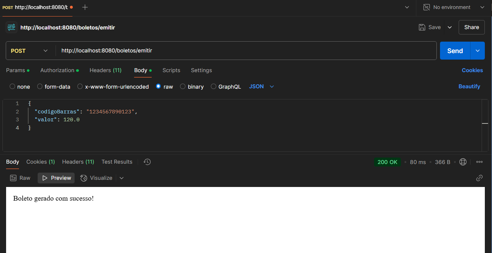

#### 3. **POST /pagamentos**

- **JSON de Requisição:**

  ```json
  {
    "metodo": "Cartão",
    "valor": 100.0
  }
  ```

- **Resposta Esperada:**

  ```json
  {
    "id": 1,
    "metodo": "Cartão",
    "valor": 100.0
  }
  ```

- **Status Code:** 201

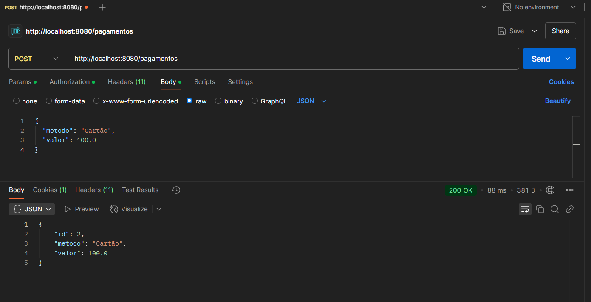

#### 4. **GET /vendas**

- **Resposta Esperada:**

  ```json
  [
    {
      "id": 1,
      "total": 100.0
    }
  ]
  ```

- **Status Code:** 200

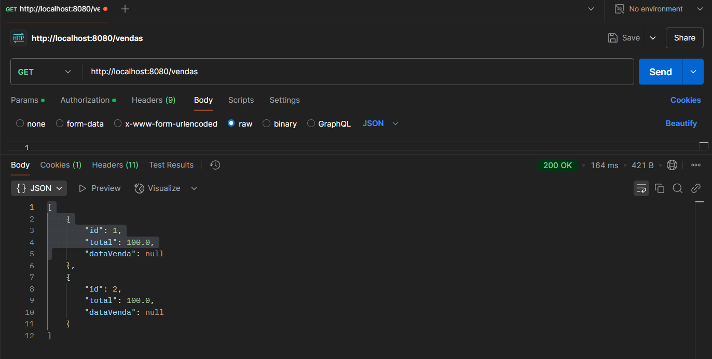

#### 5. **POST /vendas**

- **JSON de Requisição:**

  ```json
  {
    "total": 100.0
  }
  ```

- **Resposta Esperada:**

  ```json
  {
    "id": 1,
    "total": 100.0
  }
  ```

- **Status Code:** 200

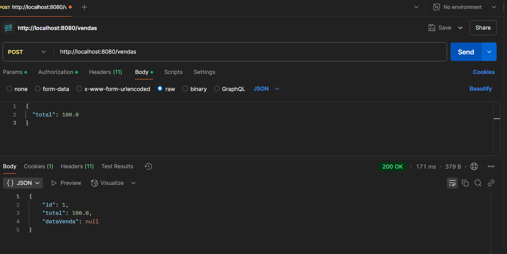

#### 6. **GET /produtos**

- **Resposta Esperada:**

  ```json
  [
    {
      "id": 1,
      "nome": "Produto A",
      "preco": 50.0,
      "estoque": 10
    }
  ]
  ```

- **Status Code:** 200

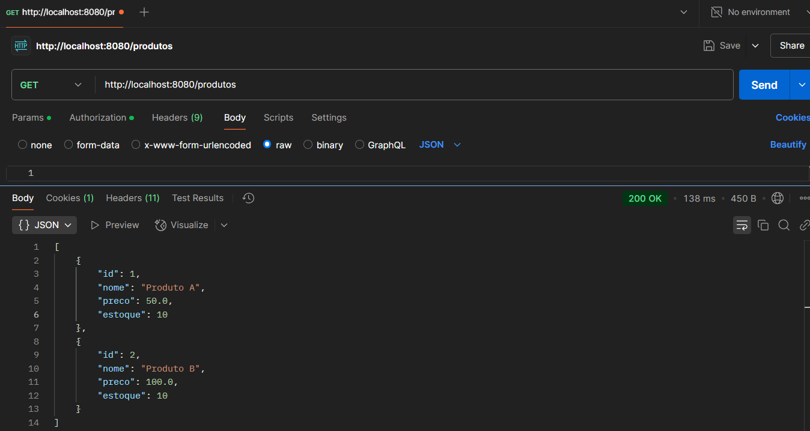

#### 7. **POST /produtos**

- **JSON de Requisição:**

  ```json
  {
    "nome": "Produto A",
    "preco": 50.0,
    "estoque": 10
  }
  ```

- **Resposta Esperada:**

  ```json
  {
    "id": 1,
    "nome": "Produto A",
    "preco": 50.0,
    "estoque": 10
  }
  ```

- **Status Code:** 200
- 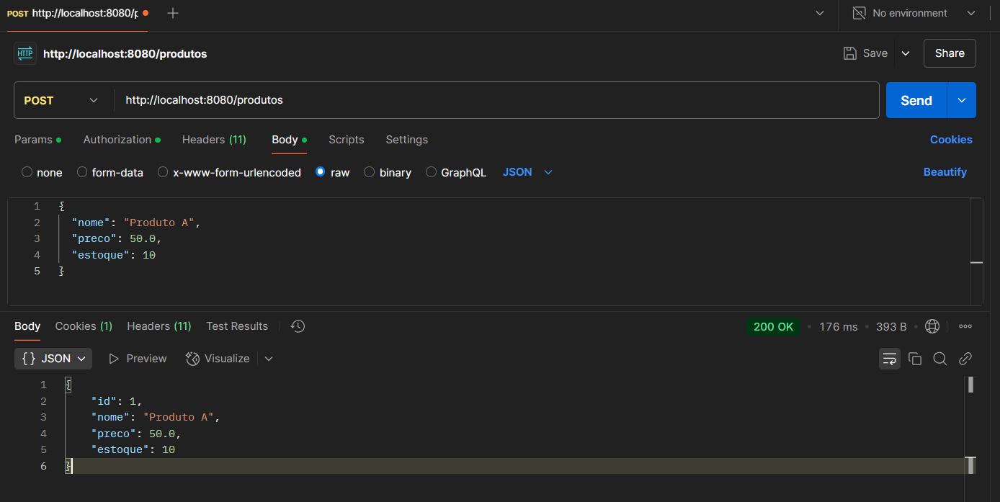

#### 8. **POST /nf/emitir**

- **JSON de Requisição:**

  ```json
  {
    "chaveAcesso": "12345678901234567890123456789012345678901234",
    "xml": "<xml>...</xml>"
  }
  ```

- **Resposta Esperada:**

  ```json
  {
    "id": 1,
    "chaveAcesso": "12345678901234567890123456789012345678901234"
  }
  ```

- **Status Code:** 200

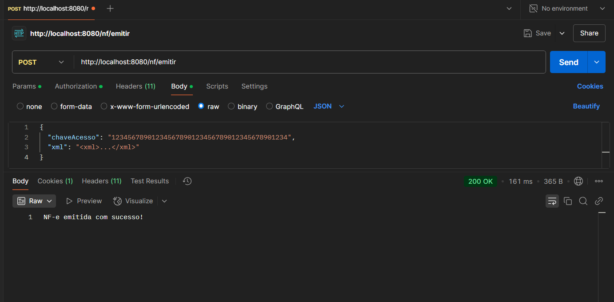

## 🏁 Considerações Finais

Agradecemos por conferir este projeto! Este é um projeto pessoal para fins de estudo.
Contribuições, sugestões e feedbacks são sempre bem-vindos.

Este projeto está licenciado sob a licença **MIT**, permitindo seu uso, modificação e distribuição conforme as condições da licença.

Desenvolvido por Wilker J C Pimenta.
